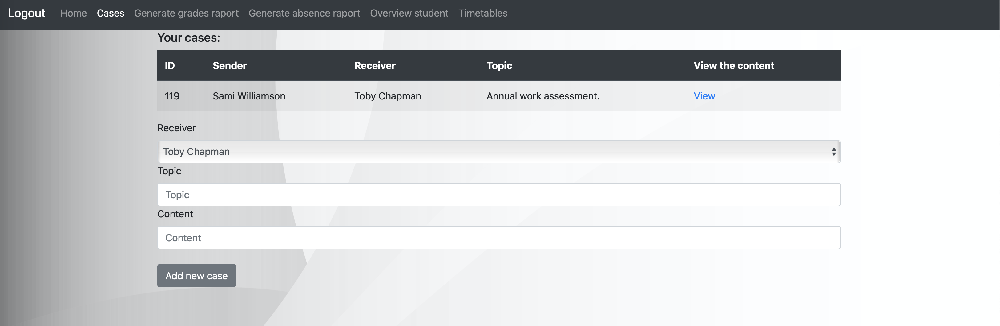

Grade Book Application
---
#### Initial informations ####

In this repository you will find application which is impelmentation of online grade book with all basic functionalities required for this kind of applications.

### Contributors ###
* [latusikl](https://github.com/latusikl)
* [syphzur](https://github.com/syphzur)
* [JChrobak](https://github.com/JChrobak)
* [michalstolorz](https://github.com/michalstolorz)
* [Suchar230](https://github.com/Suchar230)

**Curucial functionalities:**
* user types: Administrator, Teacher, Headmaster, Student, Parent;
* checking attendance;
* communication between system users;
* embeded lesson plan for teachers and students;
* giving marks;
* generating simple statistic information like average grade for class;
* possiblity to justify child absence;

---
#### How to try it out? ###

Project was connected with free remote database hosting. Until it is valid you just need to downlonad [this file](https://github.com/latusikl/eGradeBook/blob/master/jar/e-grade-book.jar) and run command:
<br/>
```
java -jar e-grade-book.jar
```
<br/>
Application will start locally on port: 8080.
<br/>
To log as admin use these credentials:
<br/>

```
Login: admin123
Password: nimda
```

Every other user visible on the list has the same password as login.
Application doesn't have configured HTTPS, so be aware that sending POST request might not work in some browsers even locally (encountered that problem with Google Chrome). There is also SQL dump available in repository.

#### Overview ####

Here you can see pictures of application UI:


***Admin Panel***

<br/>
 

***Case overview***

<br/>


***Login Page***

More picutres you can find [here](https://github.com/latusikl/eGradeBook/tree/master/img).

---

#### Additionals ####

Technologies and project language:
* Java
* Spring Boot
* JPA
* Spring MVC
* Thymleaf
* Bootstrap
* MySQL Database

Non of the projects is perfect and this one isn't too. So take in to consideration that there may occure some problems during progam usage.

---

#### Used resources ####

1. [Login form](https://colorlib.com/wp/template/login-form-v16/)
*License: CC BY 3.0*

2. [Login background](https://pxhere.com/en/photo/913893)
*License: CC0*

3. [Application background](https://www.vecteezy.com/free-vector/grey-abstract-background)

